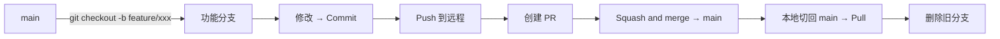
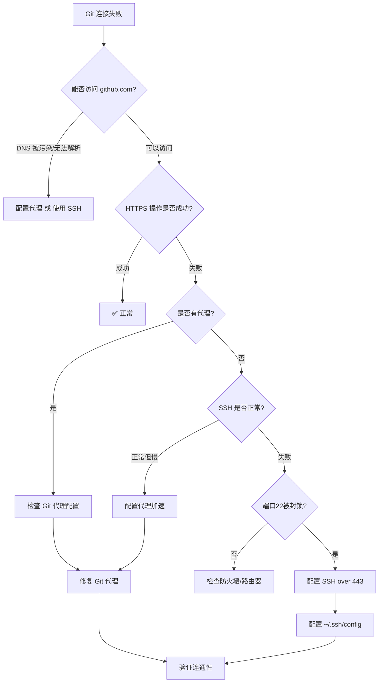

# 🧠 Git 项目全生命周期管理技能

## 概述

本技能整合了 Git/GitHub 开发中从**环境配置 → 项目初始化 → 日常开发 → 网络排障 → 仓库管理 → 发布管理**的完整操作流程，覆盖新手到老手常见问题的诊断与修复方案。

---

## 何时使用

| 场景 | 触发词/行为 |
|------|-------------|
| 新设备 SSH 配置 | "配置 SSH"、"连不上 GitHub" |
| 新项目首次推送 | "首次推送"、"新项目 push" |
| 日常开发操作 | "创建分支"、"提交 PR"、"合并"、"push/pull" |
| Git 网络连接失败 | "超时"、"连不上"、"代理"、"443 端口" |
| 仓库管理 | "修改远程地址"、"删除仓库"、"fork 同步" |
| 发布 Release | "打标签"、"发布版本"、"Release" |
| 遇到 Git 报错 | 任何 `fatal:` / `error:` / `warning:` 提示 |

---

## 前置条件

- ✅ 安装了 Git（[下载地址](https://git-scm.com/downloads)）
- ✅ 拥有 GitHub 账号
- ✅ （推荐）VS Code 已安装
- ✅ （可选）代理软件（如 v2n/Clash）已配置

## 自进化预检与安全护栏

在执行任何 `git` 变更前，先完成一轮轻量自检，避免把“可恢复的改动”变成“不可逆的事故”：

```bash
git --version
git config --global --get user.name
git config --global --get user.email
git status --short
git remote -v
```

- 若 `user.name` / `user.email` 为空，先执行配置，再继续提交。
- 若 `git status` 显示未跟踪或已修改文件，先确认是否处于正确的工作目录。
- 对新仓库首次推送，先确认远端是否已经存在；避免 `git push` 前未建立 `origin`。
- 优先使用 `git switch` / `git checkout -b` 进行分支切换，避免在主分支上直接执行高风险操作。

## GitHub Token 持久化配置（一次性 / 跨工作区复用）

> 在 HTTPS 网络受限或需要 gh CLI 自动化的场景下，将 Personal Access Token 持久化存储，可避免每次在新工作区重复创建 token。

### 操作步骤

```powershell
# 1. 在 GitHub 生成 Classic Token
#    访问 https://github.com/settings/tokens/new?description=agent-skills-push&scopes=repo,workflow
#    类型选择「Tokens (classic)」，勾选 repo（全选）和 workflow

# 2. 存储到 Git Credential Manager（推荐，最安全）
$token = "ghp_你的_token"
@("protocol=https","host=github.com","username=你的GitHub用户名","password=$token") |
  git credential-manager store

# 3. 验证存储是否成功
$env:GIT_TERMINAL_PROMPT=0
@("protocol=https","host=github.com") | git credential-manager get --no-ui
# 应输出包含 password=ghp_... 的凭据信息，无交互弹窗

# 4. （可选）下载 gh CLI 并认证
#    winget install --id GitHub.cli
#    gh auth login --with-token < token.txt
#    之后 gh CLI 也可直接使用该 token
```

### 验证跨工作区可用

切换到任意其他工作目录测试：

```powershell
git clone https://github.com/你的用户名/仓库名.git
# 应直接克隆成功，无需输入凭据
```

### 安全说明

| 做法 | 安全性 | 说明 |
|------|--------|------|
| ✅ Git Credential Manager | 🔒 高 | Token 加密存储在 Windows 凭据管理器，仅当前 Windows 用户可访问 |
| ❌ 明文写在 `$PROFILE` 或脚本中 | ⚠️ 低 | 任何能读取文件的人均可获取 |
| ❌ 提交到 `.env` 或代码仓库 | 🔴 极低 | 一旦推送即彻底泄露 |

> 每次重新申请 token 后，重复上述步骤覆盖旧 token 即可。

---

## 阶段一：SSH 密钥配置（一次性 / 每台新设备）

### 1.1 检查是否已有密钥

```bash
ls -al ~/.ssh
```

查找 `id_ed25519` 和 `id_ed25519.pub`（推荐）或 `id_rsa` / `id_rsa.pub`。

### 1.2 生成新密钥（如无密钥）

```bash
ssh-keygen -t ed25519 -C "your_email@example.com"
```

**关键操作**：
- **文件路径**：直接按 Enter 接受默认路径 `~/.ssh/id_ed25519`
- **密码短语**：可选设置，建议留空或记住

### 1.3 启动 SSH Agent 并加载密钥

```bash
eval "$(ssh-agent -s)"
ssh-add ~/.ssh/id_ed25519
```

### 1.4 添加公钥到 GitHub

```bash
cat ~/.ssh/id_ed25519.pub
# 复制输出内容（以 ssh-ed25519 开头）
```

**用户操作**：访问 GitHub → Settings → SSH and GPG keys → New SSH key → 粘贴公钥 → Add

### 1.5 验证连接

```bash
ssh -T git@github.com
# 期望输出: Hi <username>! You've successfully authenticated...
```

### 1.6 排查 SSH 连接问题

| 现象 | 原因 | 解决 |
|------|------|------|
| `Permission denied (publickey)` | 密钥未添加到 GitHub | 检查公钥是否正确添加到 GitHub |
| `Connection timed out port 22` | SSH 端口 22 被封锁 | 改用 SSH over 443（见阶段四） |
| `The authenticity of host...` | 首次连接，需确认服务器指纹 | 比对官方指纹后输入 `yes` |

**GitHub 官方服务器指纹**：

| 密钥类型 | 指纹值 |
|----------|--------|
| ED25519 | `SHA256:+DiY3wvvV6TuJJhbpZisF/zLDA0zPMSvHdkr4UvCOqU` |
| RSA | `SHA256:uNiVztksCsDhcc0u9e8BujQXVUpKZIDTMczCvj3tD2s` |

> ⚠️ **安全规则**：屏幕显示的指纹必须与官方一致，否则可能存在中间人攻击。

---

## 阶段一·附加：配置 Git 用户信息（commit 必备）

> ⚠️ **这是 Git 使用前必须完成的一步！** 首次 `git commit` 前必须配置 `user.name` 和 `user.email`，否则 Git 会报错阻止提交。

### 操作步骤

```bash
# 设置全局用户名（建议使用 GitHub 显示名称，不要用真实姓名）
git config --global user.name "Your GitHub Username"

# 设置全局邮箱（关键！见下方说明）
git config --global user.email "your_email@example.com"

# 查看当前配置
git config --global --list
```

### 🔴 邮箱配置的常见陷阱

GitHub 提供「隐私邮箱」功能（Settings → Emails → **Keep my email address private**）。若开启此选项：

| 行为 | 结果 |
|:----|:-----|
| 使用个人真实邮箱提交 | GitHub 会**拒绝推送**，报错：`Push rejected due to email privacy` |
| 使用 GitHub 提供的 `noreply` 邮箱 | ✅ 正常推送 |
| 关闭「隐私邮箱」功能 | ✅ 可用个人邮箱正常推送 |

### 如何获取正确的 GitHub noreply 邮箱

1. 访问 GitHub → **Settings** → **Emails**
2. 找到 **Keep my email address private** 复选框
3. 若已勾选，下方会显示 `noreply` 地址，有两种格式：

   | 格式 | 示例 |
   |:----|:-----|
   | **ID 格式**（推荐） | `12345678+username@users.noreply.github.com` |
   | **简洁格式** | `username@users.noreply.github.com` |

4. 复制该地址，执行：

```bash
git config --global user.email "12345678+username@users.noreply.github.com"
```

### 👨‍💻 Agent 自动检测流程

当用户执行 `git commit` 或 `git push` 遇到邮箱相关错误时，按以下流程处理：

```
用户 push 被拒（邮箱隐私错误）
    │
    ├─ 询问用户：GitHub Settings → Emails 中
    │  「Keep my email address private」是否开启？
    │
    ├─ 是 → 询问用户是否同意 Agent 自动配置 noreply 邮箱
    │     │
    │     ├─ 同意 → Agent 执行：
    │     │   1. 用 GH CLI 或引导用户从 Settings 复制 noreply 地址
    │     │   2. git config --global user.email "<noreply地址>"
    │     │   3. 重新提交并推送
    │     │
    │     └─ 不同意 → 告知用户可去 GitHub Settings 关闭此选项，
    │                  然后使用个人邮箱
    │
    └─ 否 → 检查个人邮箱格式是否正确，重新推送
```

### 验证邮箱配置是否正确

```bash
# 查看当前 Git 邮箱
git config --global user.email

# 用该邮箱提交一次测试
echo "test" > test-commit.txt
git add test-commit.txt
git commit -m "test: 验证邮箱配置"
git push origin main
# 若推送成功 → 配置正确
# 若被拒绝 → 按上述流程排查
```

---

## 阶段二：新项目首次推送（从零到 GitHub）

### 2.1 推送前准备

#### ① 配置 `.gitignore`
在项目根目录创建 `.gitignore`，防止提交敏感文件和大文件：

```text
# --- 环境与依赖 ---
venv/
.env/
.venv/
node_modules/

# --- 敏感配置 ---
.env
config.json
config.yaml
*.pem
*.key

# --- 语言缓存 ---
__pycache__/
*.py[cod]
*.egg-info/
.next/
dist/
build/

# --- 数据与日志 ---
data/
logs/
*.log

# --- IDE 与系统 ---
.vscode/
.idea/
.DS_Store
Thumbs.db
```

#### ② 确保 GitHub 仓库为纯空仓库
在 GitHub 创建仓库时：
- ❌ **不要勾选** "Add a README file"
- ❌ **不要勾选** "Add .gitignore"
- ❌ **不要勾选** "Choose a license"

> 如果误勾选了，见附录「急救：远程仓库已有初始提交」

#### ③ 暂时关闭 Ruleset（如已配置）
GitHub → Settings → Rules → Rulesets → **Disable** 保护 `main` 的规则

> 首次推送完成后记得重新 Enable

### 2.2 本地初始化与首次提交

```bash
# 初始化仓库
git init

# 统一分支名为 main
git branch -M main

# 暂存所有文件（受 .gitignore 保护的文件除外）
git add .

# 首次提交（必须先 commit！）
git commit -m "Initial commit: 项目初始化"
```

### 2.3 添加远程仓库并推送

```bash
# 添加 SSH 远程地址
git remote add origin git@github.com:用户名/仓库名.git

# 验证
git remote -v

# 首次推送（-u 建立上游追踪）
git push -u origin main
```

### 2.4 首次推送后操作

1. **重新启用 Ruleset**（如之前禁用）
2. 后续开发采用标准 PR 工作流（见阶段三）

---

## 阶段三：日常开发工作流

### 3.1 推荐的分支工作流



### 3.2 常用操作速查

```bash
# ── 分支操作 ──
git branch                    # 查看本地分支列表
git branch -a                 # 查看所有分支（含远程）
git checkout -b feature/xxx   # 创建并切换到新分支
git switch main               # 切换分支（现代语法）

# ── 提交与推送 ──
git add .                     # 暂存所有变更
git commit -m "feat: xxx"     # 提交
git push                      # 推送到远程（首次需 -u origin <分支名>）
git push -u origin feature/xxx  # 新分支首次推送

# ── 拉取与同步 ──
git pull                      # 拉取并合并（等价于 git fetch + git merge）
git pull --rebase             # 拉取并变基（保持提交历史线性）
git fetch                     # 仅拉取，不合并

# ── 状态与日志 ──
git status                    # 查看工作区状态
git log --oneline --graph     # 简洁提交历史（图形化）
git diff                      # 查看未暂存的变更

# ── 合并 PR 后清理 ──
git checkout main
git pull
git branch -d feature/xxx     # 删除本地分支
git push origin --delete feature/xxx  # 删除远程分支
```

### 3.3 VS Code 可视化操作

所有上述操作均可通过 VS Code 图形界面完成：
1. **创建分支**：底部状态栏点击分支名 → "Create new branch"
2. **提交**：Source Control 面板 → 写信息 → ✓
3. **推送**：首次推送弹窗 → "Publish Branch"
4. **创建 PR**：VS Code 弹窗 → "Create Pull Request on GitHub"
5. **同步**：底部状态栏 🔄 按钮

---

## 阶段四：Git 网络问题诊断与修复

### 4.1 诊断流程



### 4.2 配置 Git 代理（HTTPS 协议）

**核心要点**：Git **不会自动继承系统代理**，必须手动配置。

```bash
# ── 设置 HTTP 代理 ──
git config --global http.proxy http://127.0.0.1:7890
git config --global https.proxy http://127.0.0.1:7890

# ── 设置 SOCKS5 代理 ──
git config --global http.proxy socks5://127.0.0.1:1080
git config --global https.proxy socks5://127.0.0.1:1080

# ── 局域网代理（代理在其他电脑上） ──
git config --global http.proxy http://192.168.1.100:7890
git config --global https.proxy http://192.168.1.100:7890

# ── 查看当前代理配置 ──
git config --global --get http.proxy
git config --global --get https.proxy

# ── 清除代理（离开代理环境/代理失效时） ──
git config --global --unset http.proxy
git config --global --unset https.proxy

# ── 测试代理连通性 ──
curl -I --max-time 10 --proxy http://127.0.0.1:7890 https://github.com
```

### 4.3 配置 SSH over 443（端口 22 被封锁时）

编辑 `~/.ssh/config`，添加以下内容：

```
# === GitHub SSH over 443 ===
Host github.com
  Hostname ssh.github.com
  Port 443
  User git
  # HTTP 代理模式（推荐，无需额外工具）
  ProxyCommand curl -x http://127.0.0.1:7890 -s -S https://%h:%p
  # SOCKS5 代理模式（如已安装 nc）
  # ProxyCommand nc -X 5 -x 127.0.0.1:7890 %h %p
```

配置后测试：

```bash
ssh -T git@github.com
# 期望输出: Hi <username>! You've successfully authenticated...
```

### 4.4 将现有仓库从 HTTPS 切换到 SSH

```bash
# 查看当前远程地址
git remote -v

# 切换到 SSH
git remote set-url origin git@github.com:用户名/仓库名.git

# 验证
git remote -v
# 应显示: git@github.com:用户名/仓库名.git
```

---

## 阶段五：仓库管理

### 5.1 远程仓库操作

```bash
# ── 查看远程仓库 ──
git remote -v

# ── 添加远程仓库 ──
git remote add origin git@github.com:用户名/仓库名.git

# ── 修改远程地址 ──
git remote set-url origin git@github.com:用户名/仓库名.git

# ── 删除远程仓库 ──
git remote remove origin

# ── 添加多个远程（多平台同步） ──
git remote add github git@github.com:用户名/仓库名.git
git remote add gitee git@gitee.com:用户名/仓库名.git
git push github main
git push gitee main
```

### 5.2 Fork 仓库同步上游

```bash
# 添加上游仓库
git remote add upstream https://github.com/原仓库作者/原仓库名.git

# 拉取上游更新
git fetch upstream

# 合并到本地 main
git checkout main
git merge upstream/main

# 推送到自己的远程
git push origin main
```

### 5.3 仓库清理与维护

```bash
# ── 删除已合并的本地分支 ──
git branch --merged | grep -v "\*\|main" | xargs -n 1 git branch -d

# ── 删除远程已删除的分支（清理本地引用） ──
git remote prune origin

# ── 压缩提交历史（将最近 N 个提交压缩成一个） ──
git rebase -i HEAD~N

# ── 大文件清理（从 Git 历史中移除误提交的大文件） ──
# 安装 git-filter-repo 或使用 BFG Repo-Cleaner

# ── 查看仓库大小 ──
git count-objects -vH
```

---

## 阶段六：Releases 发布管理

### 6.1 语义化版本号规范

```
v1.2.3
^ ^ ^
| | └── Patch（补丁，向后兼容的 bug 修复）
| └──── Minor（次要，向后兼容的新功能）
└────── Major（主版本，不兼容的 API 变更）
```

### 6.2 创建本地标签

```bash
# ── 创建附注标签（推荐） ──
git tag -a v1.0.0 -m "Release v1.0.0: 第一个正式版本"

# ── 创建轻量标签 ──
git tag v1.0.0

# ── 查看标签列表 ──
git tag -l

# ── 查看标签详情 ──
git show v1.0.0

# ── 推送标签到远程 ──
git push origin v1.0.0

# ── 推送所有标签 ──
git push origin --tags

# ── 删除本地标签 ──
git tag -d v1.0.0

# ── 删除远程标签 ──
git push origin --delete v1.0.0
```

### 6.3 通过 GitHub Releases 发布

**操作步骤**（手动方式）：
1. GitHub 仓库 → Releases → Create a new release
2. 选择或创建标签（`v1.0.0`）
3. 填写 Release Title（如 `v1.0.0`）
4. 编写 Release Notes（变更日志）
5. 可附加二进制文件（如编译后的程序）
6. 点击 "Publish release"

**自动生成 Release Notes**：
GitHub 提供自动生成功能，点击 "Generate release notes" 即可基于 PR 标题自动生成。

### 6.4 维护 CHANGELOG.md

在项目根目录维护 `CHANGELOG.md`，格式示例：

```markdown
# Changelog

## [v1.1.0] - 2026-07-12

### Added
- 新增登录功能

### Changed
- 优化首页加载速度

### Fixed
- 修复支付页面崩溃 bug

## [v1.0.0] - 2026-06-01

### Added
- 项目初始发布
- 用户注册/登录
- 基础交易功能
```

---

## 常见错误速查表

### 初始化与推送类

| 报错信息 | 根本原因 | 快速修复 |
|:---------|:---------|:---------|
| `fatal: not a git repository` | 当前目录未初始化 Git | 执行 `git init` |
| `error: src refspec main does not match any` | 未 commit 就 push | 先 `git add .` → `git commit -m "msg"` → 再 push |
| `refusing to merge unrelated histories` | 远程仓库有初始提交，本地历史不相关 | 远程建空仓库重来（推荐），或 `git pull --allow-unrelated-histories` |
| `error: failed to push some refs` | 远程有本地没有的提交 | 先 `git pull` 再 push |

### 用户配置类（name / email）

| 报错信息 | 根本原因 | 快速修复 |
|:---------|:---------|:---------|
| `Please tell me who you are.` / `fatal: unable to auto-detect email address` | 未配置 `user.name` 和 `user.email` | 执行 `git config --global user.name "用户名"` + `user.email` |
| `Push rejected due to email privacy` | 使用了个人邮箱，但 GitHub 开启了隐私邮箱功能 | 改用 GitHub 提供的 `noreply` 邮箱（见阶段一·附加） |
| `remote: error: GH007: Your push would publish a private email address.` | 同上，GitHub 检测到个人邮箱被暴露 | 配置 `user.email` 为 `ID+username@users.noreply.github.com` |
| 提交者名称显示为未知/乱码 | `user.name` 未设置或包含特殊字符 | `git config --global user.name "你的GitHub用户名"` |

### 连接与认证类

| 报错信息 | 根本原因 | 快速修复 |
|:---------|:---------|:---------|
| `Failed to connect to github.com port 443` | HTTPS 被干扰 / 未走代理 | 配置 Git 代理 或 改用 SSH |
| `Connection timed out port 22` | SSH 端口 22 被封锁 | 配置 SSH over 443（见阶段四） |
| `Permission denied (publickey)` | SSH 密钥未添加到 GitHub | 检查公钥是否已添加到 Settings |
| `fatal: Could not read from remote repository.` | 远程地址错误或无权访问 | 检查 `git remote -v` 地址是否正确 |
| `The authenticity of host... can't be established` | 首次 SSH 连接 | 比对官方指纹后输入 `yes` |

### 代理相关类

| 报错信息 | 根本原因 | 快速修复 |
|:---------|:---------|:---------|
| `Failed to connect through proxy` | 代理服务器不可用 | 检查代理是否开启，或清除代理配置 |
| `fatal: unable to access '...': Received HTTP code 502` | 代理节点不稳定 | 切换代理节点或临时关闭代理 |
| Git 速度极慢（<100KB/s） | 代理节点差 / 未走代理 | 确认 Git 代理已配置，或换节点 |

### 分支与合并类

| 报错信息 | 根本原因 | 快速修复 |
|:---------|:---------|:---------|
| `CONFLICT (content): Merge conflict in xxx` | 两人修改了同一文件同一区域 | 手动解决冲突 → `git add` → `git commit` |
| `error: Your local changes would be overwritten` | 有未提交的修改，切换分支会丢失 | `git stash` 暂存 → 切换分支 → `git stash pop` |
| `fatal: refusing to merge unrelated histories` | 两个不相关分支的历史合并 | 添加 `--allow-unrelated-histories` 参数 |
| Push 被拒（Ruleset） | 试图直接推到受保护分支 | 改用 PR 流程，不要在 main 直接 push |

### 其他常见问题

| 问题 | 解决方案 |
|:-----|:---------|
| 提交时误写信息 | `git commit --amend -m "新信息"`（仅本地未推送时使用） |
| 暂存了不该提交的文件 | `git reset HEAD <文件>` 取消暂存 |
| 回退到某个历史版本 | `git reset --hard <commit-hash>`（谨慎！会丢失之后的所有修改） |
| 想撤回最近一次 commit | `git reset --soft HEAD~1`（保留修改）或 `git reset --hard HEAD~1`（丢弃修改） |
| 不小心把大文件提交了 | 使用 `git filter-repo` 或 `BFG Repo-Cleaner` 从历史中移除 |
| VS Code 底部分支按钮报错 | Git 功能加载失败，修复连接后重启 VS Code |
| 切换分支提示权限不足（Windows） | 关闭 VS Code 和其他占用文件的程序后重试 |

---

## 附录：实用脚本

### A. Git 代理快速切换脚本

保存为 `git-proxy-toggle.sh`，一键切换代理开关：

```bash
#!/bin/bash
# 用法: ./git-proxy-toggle.sh [on|off|status]

ACTION=${1:-status}
PROXY_HOST=${2:-127.0.0.1}
PROXY_PORT=${3:-7890}

case "$ACTION" in
    on)
        git config --global http.proxy "http://${PROXY_HOST}:${PROXY_PORT}"
        git config --global https.proxy "http://${PROXY_HOST}:${PROXY_PORT}"
        echo "✅ Git 代理已开启: http://${PROXY_HOST}:${PROXY_PORT}"
        ;;
    off)
        git config --global --unset http.proxy 2>/dev/null
        git config --global --unset https.proxy 2>/dev/null
        echo "✅ Git 代理已关闭"
        ;;
    status)
        HTTP=$(git config --global --get http.proxy 2>/dev/null)
        HTTPS=$(git config --global --get https.proxy 2>/dev/null)
        echo "HTTP 代理: ${HTTP:-未设置}"
        echo "HTTPS 代理: ${HTTPS:-未设置}"
        ;;
    *)
        echo "用法: $0 [on|off|status] [代理地址] [代理端口]"
        ;;
esac
```

### B. Git 网络诊断脚本

保存为 `git-network-check.sh`，快速诊断网络问题：

```bash
#!/bin/bash
echo "=== Git 网络诊断 ==="
echo ""

# DNS 测试
echo -n "① DNS 解析: "
ping -c 1 -W 3 github.com &>/dev/null && echo "✅ 正常" || echo "❌ 失败"

# HTTPS 端口测试
echo -n "② HTTPS (443): "
curl -I --max-time 5 https://github.com &>/dev/null && echo "✅ 可达" || echo "❌ 不可达"

# SSH 端口测试
echo -n "③ SSH (22): "
timeout 5 bash -c '</dev/tcp/github.com/22' 2>/dev/null && echo "✅ 可达" || echo "❌ 不可达"

# SSH over 443 测试
echo -n "④ SSH over 443: "
timeout 5 bash -c '</dev/tcp/ssh.github.com/443' 2>/dev/null && echo "✅ 可达" || echo "❌ 不可达"

# SSH 认证测试
echo -n "⑤ SSH 认证: "
ssh -T git@github.com 2>&1 | grep -q "successfully authenticated" && echo "✅ 通过" || echo "❌ 失败"

echo ""
echo "=== Git 代理配置 ==="
echo "HTTP: $(git config --global --get http.proxy 2>/dev/null || echo '未设置')"
echo "HTTPS: $(git config --global --get https.proxy 2>/dev/null || echo '未设置')"

echo ""
echo "=== 远程仓库地址 ==="
git remote -v 2>/dev/null || echo "(非 Git 仓库)"
```

---

## 设计原则

1. **环境感知**：自动识别用户所处网络环境（直连 / 代理 / 局域网代理），选择最优连接方案
2. **安全优先**：密钥文件永不共享，指纹验证防止中间人攻击
3. **渐进诊断**：从最简方案开始，逐步深入排查
4. **通用兼容**：所有命令兼容 Windows（Git Bash）和 Linux/Mac 环境
5. **一次配置，长期受益**：SSH 优先原则，减少重复认证和代理依赖

---

> **版本**: v1.0.0 | **适用平台**: Windows / Linux / macOS | **协议**: Git Bash 推荐 (Windows)
